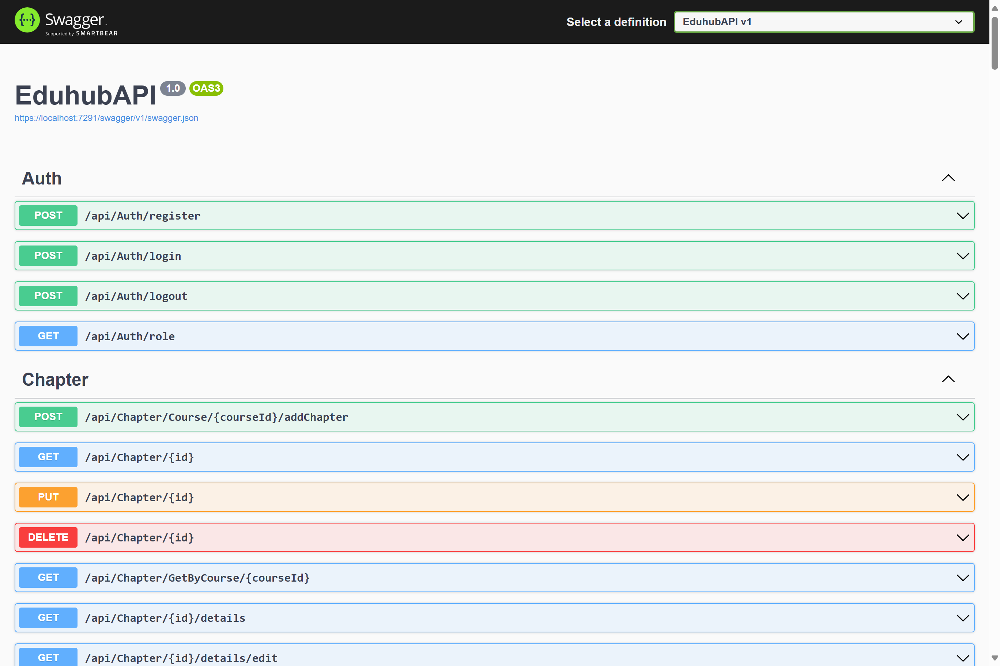

## EduhubAPI - eLearning API



### Overview

This repository houses the backend API for an eLearning platform, built using ASP.NET Core Web API, Entity Framework Core, and SQL Server. It provides a RESTful interface for managing courses, users, enrollments, and other core functionalities.

### Technologies

* **ASP.NET Core Web API:** Framework for building HTTP APIs.
* **Entity Framework Core:** ORM for data access.
* **SQL Server:** Database for storing application data.
* **RESTful API:** Architectural style for designing web services.

### Project Structure

* **Models:** Contains entity classes representing database tables.
* **Data Access Layer:** Handles database interactions using Entity Framework.
* **Controllers:** Defines API endpoints and business logic.
* **Services:** (Optional) Additional layer for business logic separation.

### Getting Started

**Prerequisites:**

* .NET Core SDK
* SQL Server or a local database instance
* A text editor or IDE (Visual Studio, Visual Studio Code)

**Clone the Repository:**

```bash
git clone https://github.com/Toan66/EduhubAPI
```

**API Usage:**

The API exposes endpoints for various operations. Refer to the `Controllers` folder for detailed information about available endpoints and their corresponding HTTP methods.